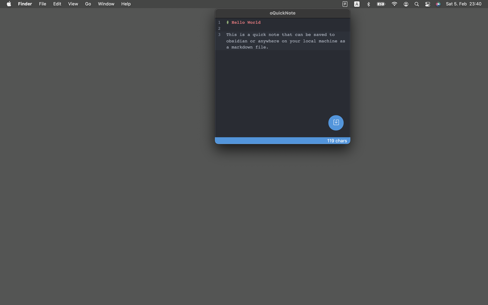

# oQuickNote (alpha)

> **⚠ WARNING: This is an alpha version**  
> This app is in early development. Some features may be broken. Use at your own risk.
----------

oQuickNote is a note taking app for mac. It lets you start taking a note from everywhere in no time. It uses a markdown editor and will store your notes to a local folder.

This app was inspired by the QuickNote tool from Evernote (maybe the only good thing left about Evernote).

If you use a note app with local file structure like [Obsidian](https://obsidian.md/) (if not, you should start using it) and still want to have the ability to quickly write a note, than oQuickNote is for you!

## Features
- open note editor from menu bar via tray icon or shortcut
- save note as markdown file to your local machine
- customize folder where notes should be stored
- customize global shortcut to open editor
- support for light and dark theme
- auto launch on system start (customizable)

### Editor


### Settings


## Installation
Since the app is still in alpha, there is no official installation file. Please see [Create App](#create-app) for more information for now. 

## Create app
You can package an app on your local machine and use it. This is normally intended for development purposes to test an app version.

```
git clone https://github.com/postnerd/oQuickNote
cd oquicknote
npm install
npm pack
```

You should find an application file at `dist/mac/oQuickNote.app`. 

## Run app from terminal for development

```
git clone https://github.com/postnerd/oQuickNote
cd oquicknote
npm install
npm run watchSrc
npm start
```

### Options

To start the app in debug mode:
```
npm start -- --isDebug
```

This will print debug information to the terminal.

To start the app in development mode:

```
npm start -- --isDev
```

This will 
- open DevTools along the editor and settings window
- prevent editor window from getting hidden on blur events (so it's possible to inspect it)
- used a red tray icon to easily distinguish this version from the production/packed version

You can of course combine options.

```
npm start -- --isDebug --isDev
```


